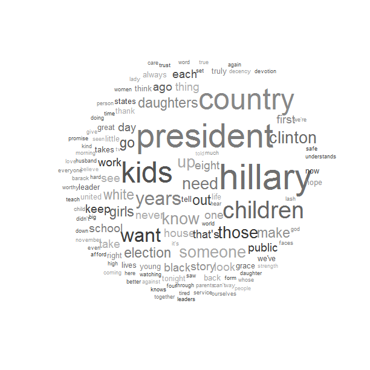

# 750project2

## Description

This repository implements a word cloud visualization in the following way:

1) Filter a text file according to the following:
	- All words should be unique
	- Does not contain stopwords
2) Calculate weight of words based on their frequency
	- Option to filter out very rare words in large documents
3) Calculate the bounding box of each word on a [0,1] x [0,1] canvas
	- Uses weight, hscale and vscale argument
4) In order of weight, pick some random coordinates (first word will be centered vertically) and check if it overlaps with any previously placed words. If it doesn't, move to the next word. Save the coordinates.
5) If it does overlap, move the coordinates around a spiral until it either no longer overlaps with any words or the spiral gets too big. 
	- If the word can't be placed, print a message

Once we have the coordinates, the bounding boxes, and the weights; we just put the words on a canvas according to the specifications.  

## Instructions

This implementation of a word cloud currently supports space-delimited .txt files. Examples of correct file format can be found in the 'nyt-collection-text' folder. Word clouds can be created from the command line using the 'word_cloud_driver.R' script. This may be run using only one argument (the text filename) or all seven arguments in this order: (filename, vscale, hscale, nmin, draw_pretty, draw_bounding_boxes, color_by_sentiment). The implementation does not support partial lists of arguments. If TRUE, draw_pretty will zoom out to capture all of the cloud and randomly grayscale the words for aesthetics. If TRUE, draw_bounding_boxes will draw the bounding boxes specified by hscale and vscale around the words in the cloud. If TRUE, color_by_sentiment uses an existing dictionary for sentiment analysis and colors the words red if negative, purple if positive, blue if masculine, pink if feminine, yellow if non-adult, black if the word is found in the dictionary but has none of the above sentiments, and a random shade of gray otherwise. 

Within an R session, the order of commands in word_cloud_driver can be replicated for more personalization. This may be desirable if there are many words that cannot be placed/the random configuration of word positions is not aesthetically pleasing/you'd like to fiddle with colors without re-running the entire algorithm. 

We provide two plotting functions: draw_orig which uses the original [0,1] x [0,1] canvas and redraw_pretty which "zooms out" to capture the entirety of each word.

## Directory Information
The following assumes your working directory is where this README file is located. This should include the following:
- folder nyt-collection-text: used for random testing and also can be used for examples
- folder other-text-files: contains the default stopwords file, the default sentiment dictionary, and the transcript from Michelle Obama's 2016 DNC speech
- folder test-files: contains files used for testing
- color_by_sentiment.R: function to color the word cloud using basic sentiment analysis
- text_processing_functions.R: functions used in the text processing phase of making a word cloud
- vis_calculation_functions.R: functions used to make the word cloud visualization
- word_cloud_driver.R: script to run the word_cloud function from command line
- word_cloud_tests.R: test suite for all functions

## Examples
From R session: 
word_cloud('other-text-files/m_obama.txt', draw_bounding_boxes = FALSE, draw_pretty = TRUE, vscale = .75, hscale = .95)

To create same word cloud from the command line: 
Rscript word_cloud_driver.R 'other-text-files/m_obama.txt' .75 95 2 TRUE FALSE TRUE
